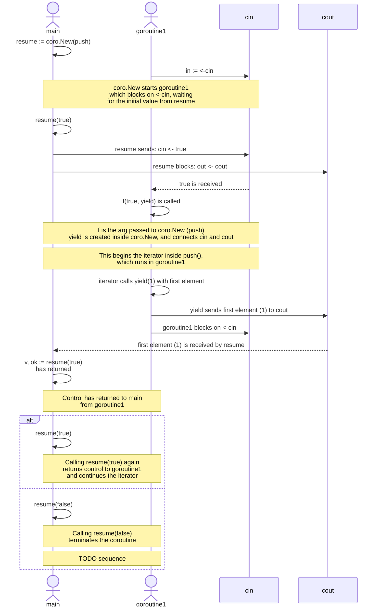

# coro

### Sample code and notes about https://research.swtch.com/coro 

* Coroutines provide __concurrency without parallelism__: when one coroutine is running, the one that resumed it or yielded to it is not.
* Because __coroutines run one at a time and only switch at specific points__ in the program, the coroutines can share data among themselves without races. 
  * The explicit switches serve as synchronization points, creating happens-before edges

## Converted Iterator Sequence

* The exact order of the initial events depends on goroutine scheduling
  * e.g. `resume` may be called before `goroutine1` blocks on `<-cin`
* `resume`
  * executes on `main`
  * returns control from `main` to `goroutine1`
* `f` function argument to `coro.New` (wrapped `iterator`)
  * executes on `goroutine1`
  * calls `yield`
    * `yield` returns control from `goroutine1` to `main`

---

## Kotlin

>  a coroutine is not bound to any particular thread. It may suspend its execution in one thread and resume in another one.
